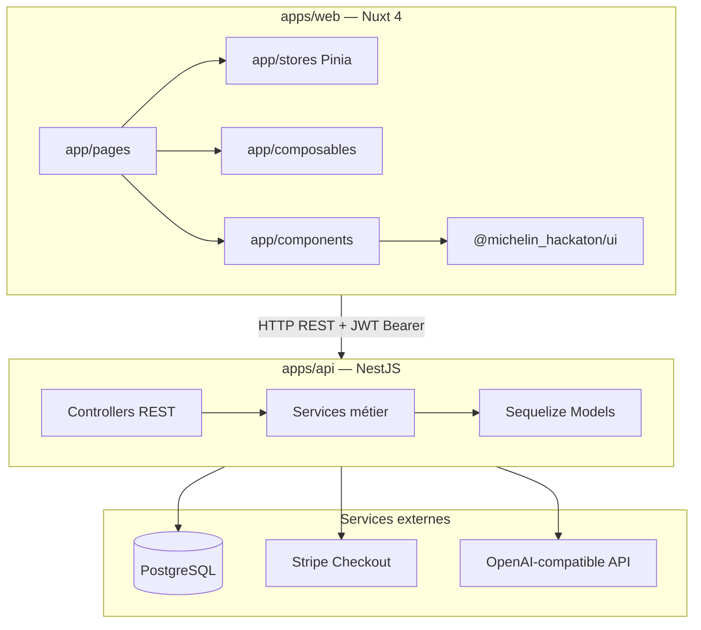
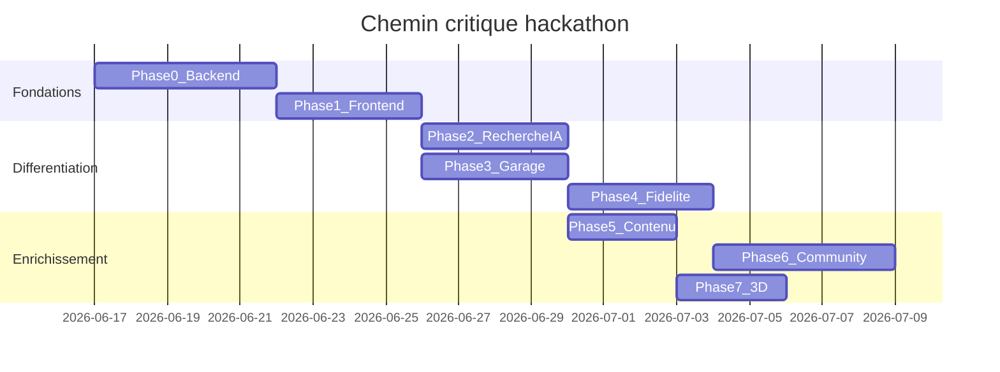
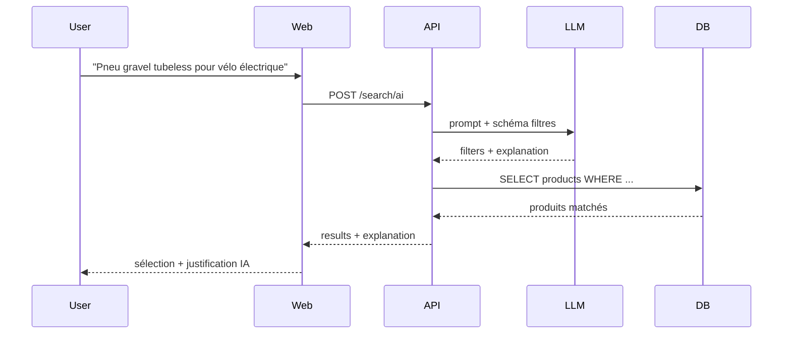

# Plan Michelin Bicycle E-commerce B2C

> Point d'appui pour le développement du hackathon Michelin.
> Cocher les cases `- [x]` au fur et à mesure de l'avancement.

**Dernière mise à jour** : 2026-06-18

---

## Progression globale

| Phase | Description                        | Points | Statut |
| ----- | ---------------------------------- | ------ | ------ |
| P0    | Fondations backend (NestJS)        | ~47    | ✅     |
| P1    | E-commerce frontend (Nuxt)         | ~43    | ✅     |
| P2    | Recherche IA + questionnaire       | ~43    | ✅     |
| P3    | Garage virtuel                     | ~43    | ✅     |
| P4    | Fidélité, cross-sell, gamification | ~58    | ✅     |
| P5    | Contenu produit enrichi            | ~32    | ✅     |
| P6    | Michelin Riders Club               | ~52    | ✅     |
| P7    | Polish & innovation (stretch)      | ~40    | ⬜     |
| DOC   | Documentation sans code            | ~9     | ⬜     |

**Cible hackathon** : ~120–150 points (P0 → P1 → P2 → P3 → P4 partiel)

---

## Vision produit

Application e-commerce B2C innovante pour vendre les pneus vélo Michelin avec :

- Parcours d'achat complet (login, panier, checkout Stripe)
- Recherche intelligente par IA (OpenAI-compatible) + questionnaire
- Garage virtuel (inventaire vélos/pneus, rappels, réachat)
- Programme de fidélité (-20% 1ère commande, points, roulette, parrainage)
- Ventes croisées, avis, comparateur, stats pros, calculateur de pression
- Communauté « Michelin Riders Club » (stretch)
- Visualisation 3D des pneus (stretch)

**Hors scope hackathon** : B2B complet (placeholder uniquement)

---

## Architecture monorepo — deux apps distinctes

| App     | Chemin      | Stack                              | Port dev | Rôle                                   |
| ------- | ----------- | ---------------------------------- | -------- | -------------------------------------- |
| **API** | `apps/api/` | NestJS 11 + Sequelize + PostgreSQL | `3001`   | Backend métier, auth, paiement, IA, DB |
| **Web** | `apps/web/` | Nuxt 4 + Vue 3 + Pinia             | `3000`   | Frontend B2C, UI, stores, pages        |



### Principes

- **Toute la logique métier** vit dans `apps/api`
- **Le front** gère affichage, validation Zod et appels API
- **Composants UI** : design system dans `packages/ui/` ; composants métier dans `apps/web/app/components/`
- **Pas de BFF Nitro** : le web appelle NestJS via `runtimeConfig.public.apiBaseUrl`
- **Types partagés** : dupliqués dans `apps/web/app/types/` (pas de package shared)

---

## État actuel

| Élément                  | État                                                                        |
| ------------------------ | --------------------------------------------------------------------------- |
| API NestJS               | `GET /` + `GET /products` uniquement                                        |
| Catalogue                | 441 pneus (`apps/api/src/products/products.seed.ts`) — sans prix ni stock   |
| Web Nuxt 4               | Page catalogue (`apps/web/app/pages/index.vue`) — filtres client-side       |
| Auth / panier / checkout | Inexistant                                                                  |
| UI layer                 | ~270 composants réutilisables (`UICard`, `UISteps`, `UIForm*`, `UIDrawer`…) |

---

## Décisions architecturales

### Paiement : Stripe Checkout (recommandé)

| Critère               | Stripe Checkout           | Polar                                         |
| --------------------- | ------------------------- | --------------------------------------------- |
| Panier multi-articles | Natif                     | Orienté SaaS / digital                        |
| Intégration NestJS    | Mature (SDK + webhooks)   | Moins d'exemples e-commerce physique          |
| Setup hackathon       | Checkout hébergé          | Rapide pour 1 produit, moins adapté au panier |
| TVA / MoR             | Suffisant pour démo FR    | MoR inclus (overkill)                         |
| Fidélité / coupons    | Stripe Coupons + metadata | Coupons dashboard                             |

**Verdict** : Stripe Checkout + webhook `checkout.session.completed`.

### Auth : Email + mot de passe + JWT

- `@nestjs/jwt` + `@nestjs/passport` + `bcrypt`
- Access token 24h (refresh token optionnel)
- Pas d'OAuth pour le hackathon

### Recherche IA : API OpenAI-compatible

```bash
# apps/api/.env
OPENAI_API_KEY=...
OPENAI_BASE_URL=https://api.openai.com/v1   # ou Ollama, Groq, etc.
OPENAI_MODEL=gpt-4o-mini
```

- LLM → `{ filters, explanation, suggestedSlugs? }`
- Backend exécute requête Sequelize sur les 441 produits
- Abstraction `LlmProvider` pour changer de modèle

### Extension modèle Product

- `priceCents`, `stock`, `currency: 'EUR'`
- `proStats` JSONB (victoires, exploits pros)
- `crossSellProductIds` (relations + règles auto)

---

## Légende estimation Poker (Scrum)

| Points | Signification        | Durée indicative |
| ------ | -------------------- | ---------------- |
| **1**  | Trivial              | < 2h             |
| **2**  | Simple               | 2–4h             |
| **3**  | Petite feature       | 1 jour           |
| **5**  | Feature moyenne      | 2–3 jours        |
| **8**  | Feature large        | 1 semaine        |
| **13** | Epic                 | 1–2 semaines     |
| **21** | Trop gros — découper | —                |

---

## Structure cible — `apps/api` (NestJS)

```
apps/api/src/
├── main.ts
├── app.module.ts
├── common/
│   ├── guards/jwt-auth.guard.ts
│   ├── decorators/current-user.decorator.ts
│   └── pipes/validation.pipe.ts
├── auth/                      # POST /auth/register, /auth/login
├── users/
├── products/                  # ✅ existant — à étendre
├── cart/
├── orders/
├── payments/                  # Stripe Checkout + webhook
├── search/                    # IA + questionnaire
├── garage/
├── loyalty/
├── cross-sell/
├── reviews/
├── community/
├── games/roulette/
└── admin/
```

**Dépendances à ajouter** : `@nestjs/jwt`, `@nestjs/passport`, `passport-jwt`, `bcrypt`, `class-validator`, `class-transformer`, `stripe`, `openai`

**Variables d'environnement** (`apps/api/.env`) :

```bash
DB_HOST, DB_PORT, DB_NAME, DB_USER, DB_PASSWORD
JWT_SECRET, JWT_EXPIRES_IN=24h
CORS_ORIGIN=http://localhost:3000
STRIPE_SECRET_KEY, STRIPE_WEBHOOK_SECRET
OPENAI_API_KEY, OPENAI_BASE_URL, OPENAI_MODEL
```

**Lancer** : `pnpm --filter @michelin_hackaton/api dev`

---

## Structure cible — `apps/web` (Nuxt 4)

```
apps/web/app/
├── pages/
│   ├── index.vue                    # ✅ existant
│   ├── login.vue, register.vue
│   ├── products/[slug].vue
│   ├── recherche.vue, trouver-mon-pneu.vue
│   ├── checkout/index.vue, checkout/success.vue
│   ├── garage/index.vue, garage/[bikeId].vue
│   ├── comparer.vue, calculateur-pression.vue, roulette.vue
│   ├── riders-club/index.vue, b2b.vue
│   └── account/orders.vue, account/loyalty.vue
├── stores/auth.ts, stores/cart.ts
├── composables/useApi.ts, useCatalogue.ts, useGarage.ts
├── components/catalogue/            # ✅ existant
├── components/commerce/, product/, search/, garage/, loyalty/, community/
├── types/product.ts, order.ts, cart.ts, user.ts, search.ts
└── utils/catalogue.ts, pressure-calculator.ts
```

**Variables d'environnement** (`apps/web/.env`) :

```bash
NUXT_PUBLIC_API_BASE_URL=http://localhost:3001
NUXT_PUBLIC_SITE_URL=http://localhost:3000
```

**Lancer** : `pnpm --filter @michelin_hackaton/web dev`

### Règle composants UI (obligatoire)

| Besoin                                                | Où ?                                  | Exemple                                                   |
| ----------------------------------------------------- | ------------------------------------- | --------------------------------------------------------- |
| Boutons, formulaires, cartes, modales, tables, steps… | **`packages/ui/`** — composants `UI*` | `UIButton`, `UIForm`, `UICard`, `UIDrawer`, `UISteps`     |
| Composants métier e-commerce (spécifiques à l'app)    | **`apps/web/app/components/`**        | `CartDrawer`, `AiSearchBar`, `BikeCard`, `ProductReviews` |

**À faire absolument :**

- Composer toutes les pages et features avec les composants existants de [`packages/ui/`](packages/ui/) (`@michelin_hackaton/ui`)
- Vérifier le catalogue avant d'écrire du HTML/CSS custom : `packages/ui/app/components/`
- S'inspirer des exemples e-commerce du playground : `packages/ui/.playground/app/pages/previews/modules/` (`CheckoutStepsScenario`, `LoginScenario`, etc.)

**Interdit pour le hackathon :**

- Créer de nouveaux composants génériques dans `packages/ui/` (hors scope, review layer)
- Réimplémenter un bouton, input, modal ou card en HTML brut alors qu'un `UI*` existe
- Dupliquer des composants déjà présents dans le design system

**Si un composant manque :**

1. Chercher l'équivalent le plus proche dans `packages/ui/`
2. Composer plusieurs `UI*` si nécessaire
3. En dernier recours, créer un composant **métier** dans `apps/web/app/components/{domaine}/` qui wrappe les `UI*`

---

## Contrat API REST

| Méthode  | Endpoint                                 | Auth        | Consommateur web        |
| -------- | ---------------------------------------- | ----------- | ----------------------- |
| `GET`    | `/products`                              | Public      | `index.vue`             |
| `GET`    | `/products/:slug`                        | Public      | `products/[slug].vue`   |
| `GET`    | `/products/compare?slugs=a,b`            | Public      | `comparer.vue`          |
| `GET`    | `/products/:id/cross-sell`               | Public      | `CrossSellCarousel.vue` |
| `GET`    | `/products/:productId/reviews`           | Public      | `Reviews.vue`           |
| `POST`   | `/products/:productId/reviews`           | JWT         | `Reviews.vue`           |
| `PATCH`  | `/products/:productId/reviews/:reviewId` | JWT         | `Reviews.vue`           |
| `DELETE` | `/products/:productId/reviews/:reviewId` | JWT         | `Reviews.vue`           |
| `POST`   | `/auth/register`                         | Public      | `register.vue`          |
| `POST`   | `/auth/login`                            | Public      | `login.vue`             |
| `GET`    | `/cart`                                  | JWT / guest | `useCartStore`          |
| `POST`   | `/cart/items`                            | JWT / guest | `CartDrawer.vue`        |
| `PATCH`  | `/cart/items/:id`                        | JWT / guest | `CartDrawer.vue`        |
| `DELETE` | `/cart/items/:id`                        | JWT / guest | `CartDrawer.vue`        |
| `POST`   | `/checkout/session`                      | JWT         | `checkout/index.vue`    |
| `POST`   | `/payments/webhook`                      | Stripe sig  | API seul                |
| `GET`    | `/orders`                                | JWT         | `account/orders.vue`    |
| `GET`    | `/orders/:id`                            | JWT         | `account/orders.vue`    |
| `POST`   | `/search/ai`                             | Public      | `AiSearchBar.vue`       |
| `POST`   | `/search/questionnaire`                  | Public      | `trouver-mon-pneu.vue`  |
| `GET`    | `/garage/bikes`                          | JWT         | `garage/index.vue`      |
| `POST`   | `/garage/bikes`                          | JWT         | `garage/index.vue`      |
| `GET`    | `/garage/bikes/:id`                      | JWT         | `garage/[bikeId].vue`   |
| `POST`   | `/garage/bikes/:id/tires`                | JWT         | `garage/[bikeId].vue`   |
| `GET`    | `/garage/suggestions`                    | JWT         | `garage/index.vue`      |
| `GET`    | `/loyalty`                               | JWT         | `account/loyalty.vue`   |
| `POST`   | `/loyalty/redeem-code`                   | JWT         | `RedeemCodeForm.vue`    |
| `POST`   | `/games/roulette/spin`                   | JWT         | `roulette.vue`          |

---

## Structure DB cible

```
users
carts / cart_items
orders / order_items
loyalty_accounts / loyalty_transactions
bikes / bike_tire_installations
reviews
community_posts
promo_codes / promo_redemptions
referrals
```

**Relations clés** :

- `User` 1—N `Bike` 1—N `BikeTireInstallation` → `Product`
- `User` 1—1 `LoyaltyAccount`
- `Order` N—1 `User`, N—N `Product` via `order_items`
- `Review` N—1 `User`, N—1 `Product`

---

## Workflow de développement local

```bash
# Terminal 1 — PostgreSQL
# Terminal 2 — API NestJS (:3001)
pnpm --filter @michelin_hackaton/api dev

# Terminal 3 — Web Nuxt (:3000)
pnpm --filter @michelin_hackaton/web dev

# Terminal 4 — Stripe webhooks (après P0-09)
stripe listen --forward-to localhost:3001/payments/webhook
```

**Ordre** : PostgreSQL → API → Web → Stripe CLI

**Parallélisation** :

- Dev A : `apps/api` (Phase 0) / Dev B : types + i18n web (P1-01, P1-12)
- Après P0-03 : Dev B attaque login/register (P1-03, P1-04)
- Phase 2+ : API et WEB en parallèle dès que les endpoints existent

---

## Chemin critique



- **Sprint 1** : P0 + P1 (~90 pts) → MVP vendable
- **Sprint 2** : P2 + P3 + P4 partiel (~90 pts) → différenciation
- **Sprint 3** : reste selon temps disponible

---

# Tâches détaillées

---

## Phase 0 — Fondations backend `apps/api` (priorité critique · ~47 pts)

> Objectif : schéma DB, auth, prix produits, panier, commandes, Stripe.
> App : **NestJS uniquement** — aucun changement Nuxt.

- [x] **P0-01** · API · 3 pts — Migration `Product` : `priceCents`, `stock`, `currency`, `proStats` JSONB
  - Fichiers : `apps/api/src/products/product.model.ts`, `apps/api/src/products/seed-prices.ts`

- [x] **P0-02** · API · 5 pts — Module `Users` : modèle Sequelize, register, login, hash bcrypt
  - Fichiers : `apps/api/src/users/`

- [x] **P0-03** · API · 5 pts — Module `Auth` : JWT strategy, guards, decorator `@CurrentUser()`
  - Fichiers : `apps/api/src/auth/`, `apps/api/src/common/guards/`, `apps/api/src/common/decorators/`

- [x] **P0-04** · API · 3 pts — DTOs + validation (`class-validator` pipe global)
  - Fichiers : `apps/api/src/common/pipes/`, DTOs par module

- [x] **P0-05** · API · 2 pts — `GET /products/:slug` — fiche produit détaillée
  - Fichiers : `apps/api/src/products/products.controller.ts`, `products.service.ts`

- [x] **P0-06** · API · 3 pts — Filtres API : `GET /products?category=&terrain=&diameter=&search=`
  - Fichiers : `apps/api/src/products/products.service.ts`

- [x] **P0-07** · API · 5 pts — Module `Cart` : session user/guest, CRUD lignes panier
  - Fichiers : `apps/api/src/cart/`

- [x] **P0-08** · API · 5 pts — Module `Orders` : modèle, statuts `pending` / `paid` / `shipped`
  - Fichiers : `apps/api/src/orders/`

- [x] **P0-09** · API · 8 pts — Stripe Checkout : `POST /checkout/session`
  - Fichiers : `apps/api/src/payments/`

- [x] **P0-10** · API · 5 pts — Webhook Stripe `checkout.session.completed` → commande + vider panier
  - Fichiers : `apps/api/src/payments/webhook.controller.ts`

- [x] **P0-11** · API · 2 pts — Seed `proStats` + script `seedPrices.ts` (prix fictifs par catégorie)
  - Fichiers : `apps/api/src/products/`

- [x] **P0-12** · API · 1 pt — Enregistrer tous les modules dans `app.module.ts`
  - Fichiers : `apps/api/src/app.module.ts`

**Phase 0 complète** : [x]

---

## Phase 1 — E-commerce frontend `apps/web` (priorité critique · ~43 pts)

> Objectif : parcours d'achat complet B2C.
> App : **Nuxt uniquement** — dépend de Phase 0.

- [x] **P1-01** · WEB · 2 pts — Types TS (`Product`, `User`, `Cart`, `Order`)
  - Fichiers : `apps/web/app/types/`

- [x] **P1-02** · WEB · 2 pts — Composable `useApi` — `$fetch` + header `Authorization: Bearer`
  - Fichiers : `apps/web/app/composables/useApi.ts`

- [x] **P1-03** · WEB · 3 pts — Store Pinia `useAuthStore` (login, register, logout, token)
  - Fichiers : `apps/web/app/stores/auth.ts`

- [x] **P1-04** · WEB · 3 pts — Pages `/login` et `/register` avec `UIForm` + Zod
  - Fichiers : `apps/web/app/pages/login.vue`, `register.vue`

- [x] **P1-05** · WEB · 5 pts — Page `/products/[slug]` — fiche produit (specs, pression, technologies)
  - Fichiers : `apps/web/app/pages/products/[slug].vue`

- [x] **P1-06** · WEB · 5 pts — Store `useCartStore` + `UIDrawer` panier latéral
  - Fichiers : `apps/web/app/stores/cart.ts`, `apps/web/app/components/commerce/CartDrawer.vue`

- [x] **P1-07** · WEB · 5 pts — Page `/checkout` avec `UISteps` (Panier → Livraison → Paiement)
  - Fichiers : `apps/web/app/pages/checkout/index.vue`

- [x] **P1-08** · WEB · 3 pts — Redirection Stripe Checkout + page `/checkout/success`
  - Fichiers : `apps/web/app/pages/checkout/success.vue`

- [x] **P1-09** · WEB · 3 pts — Page `/account/orders` — historique commandes
  - Fichiers : `apps/web/app/pages/account/orders.vue`

- [x] **P1-10** · WEB · 2 pts — Header : état connecté, icône panier, badge quantité
  - Fichiers : `apps/web/app/components/catalogue/AppSiteHeader.vue`

- [x] **P1-11** · WEB · 2 pts — `ProductCard` → lien `/products/[slug]` + bouton ajouter au panier
  - Fichiers : `apps/web/app/components/catalogue/ProductCard.vue`

- [x] **P1-12** · WEB · 3 pts — i18n : externaliser les textes catalogue existants
  - Fichiers : `apps/web/i18n/locales/fr-FR/`, `en-US/`

- [x] **P1-13** · WEB · 5 pts — E2E Playwright : login → ajout panier → checkout
  - Fichiers : `apps/web/e2e/checkout.spec.ts`

**Phase 1 complète** : [x]

---

## Phase 2 — Recherche intelligente (priorité haute · ~43 pts)

> Objectif : questionnaire + recherche IA OpenAI-compatible.
> Apps : `apps/api` + `apps/web` (parallélisable après P0-06).

### API

- [x] **P2-01** · API · 8 pts — Module `Search` : `POST /search/ai` avec prompt structuré
  - Fichiers : `apps/api/src/search/`

- [x] **P2-02** · API · 5 pts — Abstraction `LlmProvider` (interface + impl OpenAI-compatible)
  - Fichiers : `apps/api/src/search/llm.provider.ts`

- [x] **P2-03** · API · 3 pts — Prompt system : contraintes catalogue + JSON schema output
  - Fichiers : `apps/api/src/search/prompts/`

- [x] **P2-04** · API · 3 pts — `POST /search/questionnaire` — filtres depuis réponses structurées
  - Fichiers : `apps/api/src/search/questionnaire.dto.ts`

- [x] **P2-05** · API · 3 pts — Tests Jest : mapping LLM → filtres Sequelize
  - Fichiers : `apps/api/src/search/search.service.spec.ts`

### Web

- [x] **P2-06** · WEB · 8 pts — Page `/trouver-mon-pneu` — wizard questionnaire multi-étapes
  - Fichiers : `apps/web/app/pages/trouver-mon-pneu.vue`

- [x] **P2-07** · WEB · 5 pts — Composant `AiSearchBar` — champ libre + bulle explication IA
  - Fichiers : `apps/web/app/components/search/AiSearchBar.vue`

- [x] **P2-08** · WEB · 5 pts — Page `/recherche` — filtres manuels + résultats IA
  - Fichiers : `apps/web/app/pages/recherche.vue`

- [x] **P2-09** · WEB · 2 pts — Intégrer `AiSearchBar` dans `AppSiteHeader` + `Hero`
  - Fichiers : `apps/web/app/components/catalogue/`

- [x] **P2-10** · WEB · 1 pt — Types `SearchResult`, `AiSearchResponse`
  - Fichiers : `apps/web/app/types/search.ts`

**Phase 2 complète** : [x]



---

## Phase 3 — Garage virtuel (priorité haute · ~43 pts)

> Objectif : inventaire vélo/pneus, historique, réachat direct.

### API

- [x] **P3-01** · API · 5 pts — Modèles `Bike`, `BikeTireInstallation` (Sequelize)
  - Fichiers : `apps/api/src/garage/`

- [x] **P3-02** · API · 5 pts — CRUD `/garage/bikes`, `/garage/bikes/:id/tires`
  - Fichiers : `apps/api/src/garage/garage.controller.ts`

- [x] **P3-03** · API · 3 pts — Lien installations ↔ commandes (historique achat auto)
  - Fichiers : `apps/api/src/garage/garage.service.ts`

- [x] **P3-04** · API · 5 pts — Rappels remplacement (> 3000 km ou > 18 mois)
  - Fichiers : `apps/api/src/garage/reminder.service.ts`

- [x] **P3-05** · API · 5 pts — `GET /garage/suggestions` — pneus selon saison + type vélo
  - Fichiers : `apps/api/src/garage/suggestions.service.ts`

### Web

- [x] **P3-06** · WEB · 8 pts — Page `/garage` — liste vélos, état pneus, alertes
  - Fichiers : `apps/web/app/pages/garage/index.vue`

- [x] **P3-07** · WEB · 5 pts — Page `/garage/[bikeId]` — détail, historique, bouton « Racheter »
  - Fichiers : `apps/web/app/pages/garage/[bikeId].vue`

- [x] **P3-08** · WEB · 2 pts — Composable `useGarage` + types `Bike`, `TireInstallation`
  - Fichiers : `apps/web/app/composables/useGarage.ts`

- [x] **P3-09** · WEB · 3 pts — Flow « Ajouter au garage » post-achat (modal checkout success)
  - Fichiers : `apps/web/app/pages/checkout/success.vue`

- [x] **P3-10** · WEB · 2 pts — `ReorderButton` → ajout panier direct depuis le garage
  - Fichiers : `apps/web/app/components/garage/ReorderButton.vue`

**Phase 3 complète** : [x]

---

## Phase 4 — Fidélité, ventes croisées, gamification (priorité haute · ~58 pts)

### API

- [x] **P4-01** · API · 5 pts — Modèle `LoyaltyAccount` + `LoyaltyTransaction`
  - Fichiers : `apps/api/src/loyalty/`

- [x] **P4-02** · API · 5 pts — +100 pts inscription, -20% 1ère commande (coupon Stripe)
  - Fichiers : `apps/api/src/loyalty/welcome.service.ts`

- [x] **P4-03** · API · 3 pts — Points à l'achat (1 pt/€) via webhook commande
  - Fichiers : `apps/api/src/loyalty/`

- [x] **P4-04** · API · 5 pts — Catalogue récompenses + échange points
  - Fichiers : `apps/api/src/loyalty/rewards.seed.ts`

- [x] **P4-05** · API · 5 pts — Module `CrossSell` : règles chambre à air, pneu complémentaire
  - Fichiers : `apps/api/src/cross-sell/`

- [x] **P4-06** · API · 5 pts — `POST /loyalty/redeem-code` — codes QR / emballage
  - Fichiers : `apps/api/src/loyalty/loyalty.controller.ts`

- [x] **P4-07** · API · 5 pts — Roulette backend : 1 spin/jour, gains points ou %
  - Fichiers : `apps/api/src/games/roulette/`

- [x] **P4-08** · API · 8 pts — Parrainage : code unique, +pts parrain/filleul
  - Fichiers : `apps/api/src/loyalty/referral.service.ts`

### Web

- [x] **P4-09** · WEB · 3 pts — `CrossSellCarousel` sur PDP + panier + garage
  - Fichiers : `apps/web/app/components/commerce/CrossSellCarousel.vue`

- [x] **P4-10** · WEB · 3 pts — Widget points fidélité header + `/account/loyalty`
  - Fichiers : `apps/web/app/components/loyalty/`, `apps/web/app/pages/account/loyalty.vue`

- [x] **P4-11** · WEB · 5 pts — Page `/roulette` + composant `RouletteWheel`
  - Fichiers : `apps/web/app/pages/roulette.vue`

- [x] **P4-12** · WEB · 3 pts — Composant saisie code promo / QR
  - Fichiers : `apps/web/app/components/loyalty/RedeemCodeForm.vue`

- [x] **P4-13** · WEB · 3 pts — Parrainage : lien `/register?ref=CODE`
  - Fichiers : `apps/web/app/pages/register.vue`

**Phase 4 complète** : [x]

---

## Phase 5 — Contenu produit enrichi (priorité moyenne · ~32 pts)

### API

- [x] **P5-01** · API · 5 pts — Modèle `Review` + CRUD `/products/:id/reviews`
  - Fichiers : `apps/api/src/reviews/`

- [x] **P5-02** · API · 3 pts — `GET /products/compare?slugs=a,b` — données comparatives
  - Fichiers : `apps/api/src/products/products.controller.ts`, `apps/api/src/products/products.service.ts`

### Web

- [x] **P5-03** · WEB · 5 pts — Section avis sur PDP + `UIFormRating`
  - Fichiers : `apps/web/app/components/product/Reviews.vue`

- [x] **P5-04** · WEB · 8 pts — Page `/comparer` — sélection 2 pneus, tableau stats
  - Fichiers : `apps/web/app/pages/comparer.vue`

- [x] **P5-05** · WEB · 3 pts — Bloc « Performances pros » sur PDP (`proStats`)
  - Fichiers : `apps/web/app/components/product/ProStats.vue`

- [x] **P5-06** · WEB · 3 pts — Calculateur pression (logique pure, sans API)
  - Fichiers : `apps/web/app/utils/pressure-calculator.ts`

- [x] **P5-07** · WEB · 5 pts — Page `/calculateur-pression` — formulaire poids + vélo
  - Fichiers : `apps/web/app/pages/calculateur-pression.vue`

**Phase 5 complète** : [x]

---

## Phase 6 — Michelin Riders Club (priorité basse · ~52 pts)

### API

- [x] **P6-01** · API · 5 pts — Modèle `CommunityPost` (avis, test, photo, vidéo, challenge)
  - Fichiers : `apps/api/src/community/`

- [x] **P6-02** · API · 5 pts — Feed API paginé + filtres par type
  - Fichiers : `apps/api/src/community/community.controller.ts`

- [x] **P6-03** · API · 8 pts — Upload images (stockage local)
  - Fichiers : `apps/api/src/community/uploads/`

- [x] **P6-04** · API · 13 pts — Challenges communautaires + leaderboard
  - Fichiers : `apps/api/src/community/challenges/`

- [x] **P6-05** · API · 5 pts — Modération basique (signalement, hide)
  - Fichiers : `apps/api/src/community/moderation/`

### Web

- [x] **P6-06** · WEB · 8 pts — Page `/riders-club` — feed, création post
  - Fichiers : `apps/web/app/pages/riders-club/index.vue`

- [x] **P6-07** · WEB · 8 pts — Composants `PostCard`, `CreatePostForm`, `ChallengeBoard`
  - Fichiers : `apps/web/app/components/community/`

**Phase 6 complète** : [x]

---

## Phase 7 — Polish & innovation (priorité basse / stretch · ~40 pts)

### API

- [ ] **P7-05** · API · 8 pts — Module admin : stats commandes, stocks
  - Fichiers : `apps/api/src/admin/`

### Web

- [ ] **P7-01** · WEB · 13 pts — Viewer 3D pneu TresJS + GLB par catégorie
  - Fichiers : `apps/web/app/components/product/TireViewer3D.vue`

- [ ] **P7-02** · WEB · 2 pts — CSP nuxt-security : autoriser scripts 3D en prod
  - Fichiers : `apps/web/nuxt.config.ts`

- [ ] **P7-03** · WEB · 8 pts — PWA : notifications rappel remplacement pneu
  - Fichiers : `apps/web/nuxt.config.ts`

- [ ] **P7-04** · WEB · 1 pt — Page B2B placeholder « Espace revendeur — bientôt »
  - Fichiers : `apps/web/app/pages/b2b.vue`

- [ ] **P7-06** · WEB · 8 pts — Dashboard admin commandes/stocks
  - Fichiers : `apps/web/app/pages/admin/`

**Phase 7 complète** : [ ]

---

## Documentation sans code (~9 pts)

- [ ] **DOC-01** · 2 pts — Stratégie d'acquisition client (SEO, influence, parrainage, QR packaging)
  - Fichier : `docs/business/acquisition-strategy.md`

- [ ] **DOC-02** · 2 pts — Gantt projet hackathon
  - Fichier : `docs/project/gantt.md`

- [ ] **DOC-03** · 2 pts — Architecture technique (diagrammes)
  - Fichier : `docs/architecture/ecommerce.md`

- [ ] **DOC-04** · 3 pts — Parcours utilisateur (wireflows)
  - Fichier : `docs/ux/user-journeys.md`

**Documentation complète** : [ ]

---

## Idées innovantes (hors code — stratégie commerciale)

- [ ] Code imprimé dans le pneu ou QR emballage → points fidélité / bon d'achat (10€ pour 100€)
- [ ] Stratégie d'acquisition : influenceurs cyclisme, SEO longue traîne (« quel pneu gravel tubeless »)
- [ ] Offre de bienvenue : -20% première commande à la création de compte
- [ ] Roulette quotidienne pour engagement et rétention
- [ ] Parrainage cycliste : viralité communautaire
- [ ] Garage virtuel : rappels remplacement → réachat facilité en 1 clic
- [ ] Stats pros par pneu : argument de conversion data-driven
- [ ] Comparateur 2 pneus : réduire la friction de choix

---

## Conventions techniques

### `apps/api` (NestJS)

- Modules par domaine, pattern `products/`
- Sequelize + `sync: { alter: true }` (pas de migrations formelles pour le hackathon)
- Guards JWT + decorator `@Public()` pour routes ouvertes
- Tests Jest `*.spec.ts` pour services critiques
- Nouvelles deps via catalog `pnpm-workspace.yaml`
- Port `3001`, CORS `http://localhost:3000`

### `apps/web` (Nuxt 4)

- App thin : logique métier dans l'API
- **Composants UI** : utiliser **obligatoirement** [`packages/ui/`](packages/ui/) (`UIButton`, `UIForm`, `UICard`, `UIDrawer`, `UISteps`, `UITable`, `UIFormRating`…)
- **Nouveaux composants** : uniquement dans [`apps/web/app/components/`](apps/web/app/components/) — composants métier qui composent les `UI*`, jamais dans `packages/ui/`
- `<script setup lang="ts">`, Pinia, Zod
- `useApi()` pour tous les appels NestJS
- Types dans `app/types/`, utils purs dans `app/utils/`
- E2E Playwright dans `e2e/`
- Hérite de `@michelin_hackaton/ui` → `@michelin_hackaton/nuxt-essentials`

### Transversal

- `nuxt-security` désactivé en dev ; signature webhook Stripe vérifiée côté API
- Prix démo : road 45–89€, mtb 35–65€, gravel 40–75€, etc.
- B2B reporté post-hackathon

---

## Risques et mitigations

| Risque                           | Mitigation                                                    |
| -------------------------------- | ------------------------------------------------------------- |
| LLM retourne filtres invalides   | Zod parse + fallback filtres vides + message explicatif       |
| 441 produits sans images réelles | `imageKey` + visuels `ProductTireVisual`                      |
| Scope trop large                 | Chemin critique P0→P1→P2→P3 ; P6/P7 = stretch                 |
| Réinvention de composants UI     | Toujours `packages/ui/` en priorité ; métier dans `apps/web/` |
| Stripe webhook en local          | `stripe listen --forward-to localhost:3001/payments/webhook`  |
| Pas de prix dans seed actuel     | Script `seedPrices.ts` au bootstrap                           |

---

## Récapitulatif par priorité

| Priorité        | Phases        | API pts  | WEB pts  | Total    |
| --------------- | ------------- | -------- | -------- | -------- |
| Critique        | P0 + P1       | ~47      | ~43      | ~90      |
| Haute           | P2 + P3 + P4  | ~86      | ~58      | ~144     |
| Moyenne         | P5            | ~8       | ~24      | ~32      |
| Basse / stretch | P6 + P7 + DOC | ~44      | ~48      | ~97      |
| **Total**       |               | **~185** | **~173** | **~363** |

Répartition ~50% API / ~50% WEB — travail parallèle possible sur 2 développeurs.
